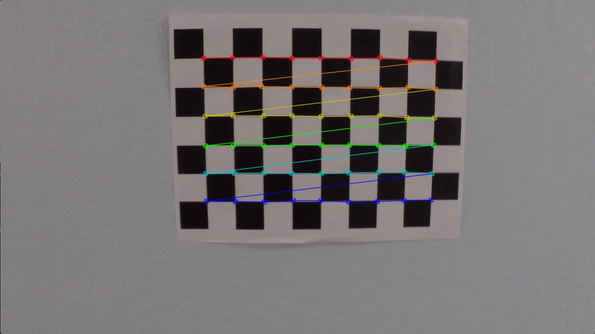

# **Advanced Lane Finding Project Write-up** 

### This is a write up on the Advanced Lane Finding project

---

### **Goals of the Advanced Lane Finding Project**

* Compute the camera calibration matrix and distortion coefficients given a set of chessboard images.
* Apply a distortion correction to raw images.
* Use color transforms, gradients, etc., to create a thresholded binary image.
* Apply a perspective transform to rectify binary image ("birds-eye view").
* Detect lane pixels and fit to find the lane boundary.
* Determine the curvature of the lane and vehicle position with respect to center.
* Warp the detected lane boundaries back onto the original image.
* Output visual display of the lane boundaries and numerical estimation of lane curvature and vehicle position.

[//]: # (Image References)

[image1]: ./examples/undistort_output.png "Distorted and Undistorted images"
[image2]: ./examples/BinaryThreshold.png "Binary Threshold Image"
[image3]: ./examples/warped_straight_lines.png "Warp Example"
[image4]: ./examples/color_fit_lines.jpg "Fit Visual"
[image5]: ./examples/example_output.jpg "Output"
[video1]: ./project_video.mp4 "Video"

---

### *Camera Calibration*

**1. Briefly state how you computed the camera matrix and distortion coefficients. Provide an example of a distortion corrected calibration image.**

The code for this step is contained in the **_caliberate_camera()_** function defined in the "Caliberate Camera" section (9th cell) of the IPython notebook.  

* Calibration is done using a set of standard chessboard images that are available in the 'camera_cal/' folder.
* Object points are chosen as the corners of the 9x6 chessboard.  The chessboard is fixed on the (x, y) plane at z=0, such that the object points are the same for each calibration image.  The object points will be the array of coordinates of the chessboard corners.
* Each of the calibration chessboard images are grayscaled and fed into OpenCV's _findChessboardCorners()_ function which returns the corner positions identified in the image.
* If corners were successfully identified, `imgpoints` will be appended with the (x, y) pixel position of each of the corners in the image plane with each successful chessboard detection.
* `objp` is just a replicated array of coordinates, and `objpoints` will be appended with a copy of it every time there is a successful corner detection in a test image.    
* A diagram showing the identified corners is pasted below for reference
* The `objpoints` and `imgpoints` are used to compute the camera calibration and distortion coefficients using OpenCV's  _calibrateCamera()_ function.
* The distortion coefficients obtained in the previous step are applied to correct the test image provided using OpenCV's' _undistort()_ function.  The resulting corrected image is shown below.

Chessboard with corners found  
Distorted and Undistorted images  
 
  
   
   
### *Pipeline (single images)*

**1. Provide an example of a distortion-corrected image.**

The code for this step is contained in the "Undistortion Correction" section (12th cell) of the IPython notebook.  A sample image is read and undistorted using the coefficients calculated during camera caliberation.

![alt text][image1]

**2. Describe how (and identify where in your code) you used color transforms, gradients or other methods to create a thresholded binary image.  Provide an example of a binary image result.**

The code for this step is contained in the **_get_binary_warp()_** function defined in the "Extract warped binary image of the lanes" section (4th cell) of the IPython notebook.

Below are the steps taken to get a thresholded binary image :

* The function takes in a 3 channel RGB olor image and returns a warped binary image with the lane markings.
* The input image is first undistorted using the coefficients returned by camera caliberation.
* The lighting conditions are determined by calculating the average luminosity of the bottom half.  A low value would indicate shady conditions or cloudy conditions.  Refer function  **_check_lighting()_** under "Define support functions" section (3rd cell).
* If the lighting conditions are poor, then the luminosity is augmented (similar to turning on 'Head Lights' during manual driving).  This is to correct the input image before feeding it into the pipeline.  Refer function  **_switch_on_headlights()_** under "Define support functions" section (3rd cell).
* Image is converted to grayscale for gradient thresholding.  Low intensity pixels are filtered out of the gray image to remove all black pixels from image.
* Color threshold images on S and L channels of HLS color space are obtained.  Pixels present in both S and L threshold images are filtered out to form the final color threshold image. 
* Gradient thresholds images on x and y directions are obtained.  Pixels present in both x and y direction threshold images are filtered out to form the final gradient threshold image. 
* Combine the color and gradient thresholded images to form the final binary image.
* Apply mask on the binary image to filter out only the region of interest (lanes)

Below are images of the input, output and some of the intermediate images used in the processing.
![alt text][image2]

**3. Describe how (and identify where in your code) you performed a perspective transform and provide an example of a transformed image.**

The code for calculating perspective M and Inverse perspective Minv is contained in the **_compute_perspective()_** function defined in the "Compute Perspective Transform" section (10th cell) of the IPython notebook.
The code for invoking warp using perspective M is contained in the **_get_binary_warp()_** function defined in the "Extract warped binary image of the lanes" section (4th cell) of the IPython notebook.

* Hard-coding approach for source and destination points has been taken for this project.
* Different perspective for different terrain types (Freeway in Project video, Highway in Challenge video and Mountain roads in Harder challenge video)
* The perspective transform M and inverse perspective transform Minv are calcuated using the source and destination points based on the terrain types
* In the **_get_binary_warp()_** function, the final masked binary threshold image is warped using the perspective transform M.

The perspective transform was verified on a test image and the results are shown below.

![alt text][image3]


**4. Describe how (and identify where in your code) you identified lane-line pixels and fit their positions with a polynomial**

The code for getting the left and right lane fits is contained in the **_get_line_fits()_** function defined in the "Extract left and right lane fits from a warped binary image" section (7th cell) of the IPython notebook.

Below is the algorithm used to get the left and right lane fits from a given binary thresholded warped image of the lanes :

1. Check if fresh lanes have to be identified.  This will be needed for the very first frame and also when there have been a few consequtive bad lanes
    1. If fresh lanes detection is needed, calculate fresh left and right lane pixels using using the sliding window technique.
    2. If fresh lanes detection is not needed, use the left and right fit from the previous good frame and calculate the x & y indices for the current frame
2. If there are 0 pixels are identified, then use the previous frame pixels.  This can happen in low-light conditions like shades, underpass etc.
3. Find the new left and right lane fits for the current frame from the pixels identified.
4. Sanity check is done on the identified lane (like lane width, curvature etc).  The function **_sanity_check_lanes()_** is used to perform these checks.
    1. If the sanity checks pass, then the current frame is deemed good and a new line object with the current lane parameters is created.
    2. If the line is good, then the co-efficient values are smoothed over the last 5 frames for smoothing purposes.
    3. If the sanity checks fail, then the current frame is deemed bad and the previous frame parameters are set for the current frame line object.
    4. If the sanity checks fail, the bad line counter is increamented by 1.  If more than 3 consequtive bad lines lines are identified, then the flag to detect fresh lanes is switched on.
7. The line object is added to a list (detected_lines[]) so that it can be used in subsequent frames for smoothing

Below are the sanity check rules that have been applied :

This resulted in the following source and destination points:

| Sanity Type       | Check Applied                                                                     |  
|:-----------------:|:---------------------------------------------------------------------------------:| 
| Same Frame Check  | Verify that left and right lanes have sufficient pixels to get good line fits     | 
| Same Frame Check  | Verify lane widths at base and top are within reasonable limits                   | 
| Same Frame Check  | Verify that left and right lane curvatures are within reasonable limits           | 
| Same Frame Check  | Verify that left and right lane curvatures are similar                            | 
| Same Frame Check  | Verify that left and right fit 2nd order co-efficients are similar                | 
| Same Frame Check  | Verify that left and right fit 1st order co-efficients are similar                | 
| Prev Frame Check  | Verify that left and right base x values are similar to values from prev frame    |
| Prev Frame Check  | Verify that left and right curvature values are similar to values from prev frame |
| Prev Frame Check  | Verify that offset from center value is similar to value from prev frame          |

Below image shows the left and right lane pixels identified in red and blue respectively:

![alt text][image4]

**5. Describe how (and identify where in your code) you calculated the radius of curvature of the lane and the position of the vehicle with respect to center.**

The code for calculating radius of curvature and position of the vehicle is contained in the **_get_line_fits()_** function defined in the "Extract left and right lane fits from a warped binary image" section (7th cell) of the IPython notebook.

* The curvature is calculated in meters
* The overall curvature is calcuated as the average of left and right curvatures
* The left and right fit are recalculated for meters by applying a 'Pixel to Meter' conversion constanty to x and y values seperately
    * Pixel to meter conversion for y is calculated as 30 / 720.  This is based on the assumption that 30m of lane fits the image height which is 720px
    * Pixel to meter conversion for x is calculated as 30 / baseline_lane_width.  The baseline land width is calculated in function **_compute_lane_width_** using a standard straight line image.
* The formula used is shown below.
```python
    # Calculate the new radii of curvature
    left_curverad = ((1 + (2*left_fit_cr[0]*y_eval*ym_per_pix + left_fit_cr[1])**2)**1.5) / np.absolute(2*left_fit_cr[0])
    right_curverad = ((1 + (2*right_fit_cr[0]*y_eval*ym_per_pix + right_fit_cr[1])**2)**1.5) / np.absolute(2*right_fit_cr[0])
```

* The position of the vehicle is determined using the below logic:
    *  The lane width is calcuated using the x value of the left and right lanes at the base
    *  The lane center is calculated by adding one half of the lane width to the left lane x
    *  Image center is calculated as the midpoint of the image (Image width / 2)
    *  The vehicle offset from lane center is calcuated as the difference between the image center and lane center
        * If the difference is positive, then the vehicle is to the right of lane center
        * If the difference is negative, then the vehicle is to the left of lane center
    *  Values are converted from pixel to meters using the conversion rate calcuated earlier.

#### 6. Provide an example image of your result plotted back down onto the road such that the lane area is identified clearly.

The code for plotting the identified lanes back down onto the road is contained in the **_lane_marker_pipeline()_** function defined in the "Lane Marker Pipeline" section (8th cell) of the IPython notebook.

* Evenly distributed y values are calcuated for the height of the image (0 to 720) using the numpy.linespace function
* The left and right x values are calcuated using the smoothened left and right fits respectively.
* The left lane, right lane and region inbetween are shaded in red, blue and green respectively.
* The lines are then warped using inverse perspective
* The inverse warped lines are then overlayed on the orignal image to mark the lanes.

![alt text][image5]

---

### Pipeline (video)

#### 1. Provide a link to your final video output.  Your pipeline should perform reasonably well on the entire project video (wobbly lines are ok but no catastrophic failures that would cause the car to drive off the road!).

Here's a [link to my video result](./project_video.mp4)

---

### Discussion

#### 1. Briefly discuss any problems / issues you faced in your implementation of this project.  Where will your pipeline likely fail?  What could you do to make it more robust?

Here I'll talk about the approach I took, what techniques I used, what worked and why, where the pipeline might fail and how I might improve it if I were going to pursue this project further.  